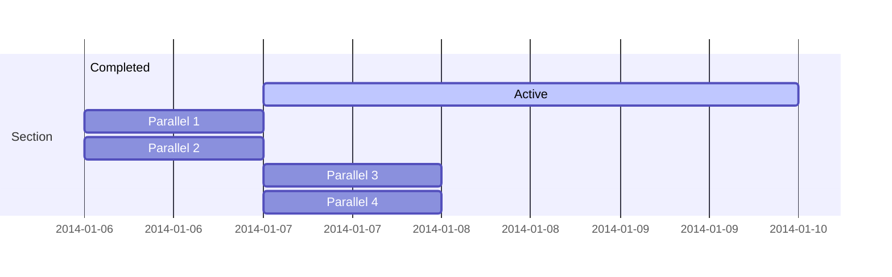
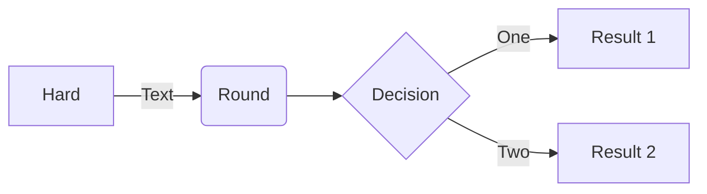
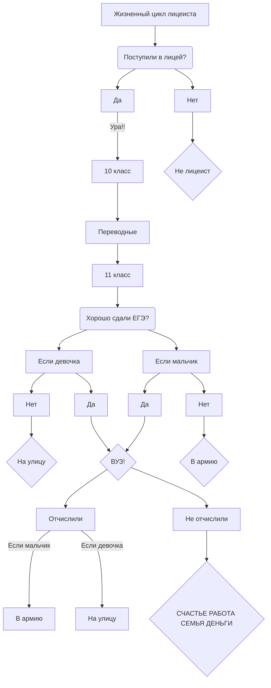
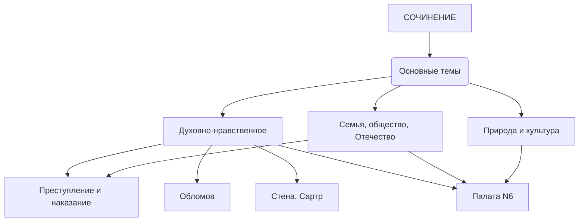

# for_lyceum

Это репозиторий **Медведевой Анастасии** из **051 группы**!

http://project6514434.tilda.ws/

<!-- clock widget start -->
 

<a href="https://nochi.com/time/tomsk-17430">Томск</a> 

 
<!-- clock widget end -->
    
    
 <!-- clock widget start -->
 

<a href="https://nochi.com/time/novosibirsk-17760">Новосибирск</a> 

 
<!-- clock widget end -->
   

    
        
    

<a href="https://github.com/TheStrangeMatter" class="button_1670306522013" target="_blank">
  МОЙ GITHUB!!!
</a>

## Навигация

[Формулы в Latex'е](https://github.com/TheStrangeMatter/for_lyceum/blob/main/latex.md)

[Юпитер](https://github.com/TheStrangeMatter/for_lyceum/blob/main/medved-checkpoint.ipynb)

[База данных](https://github.com/TheStrangeMatter/for_lyceum/blob/main/orders.db)

[SQL запросы](https://github.com/TheStrangeMatter/for_lyceum/blob/main/sql.md)

[SQL](https://github.com/TheStrangeMatter/for_lyceum/blob/main/sqlite3%20test.py)

<iframe frameborder="0" style="width:100%;height:444px;" src="https://viewer.diagrams.net/?tags=%7B%7D&highlight=0000ff&edit=_blank&layers=1&nav=1&title=rer.drawio#R7Vrfb5swEP5r8lgJTKHssSRtN239oaXStL1MDrjgxWBmzJLur98Z7BACSVNly7KJlwh%2Fdxx39vcddpKRM06XNwLnyS2PCBshK1qOnMkIIR%2FZ8KmA5xpwkVUDsaBRDdkNMKU%2FiQaNW0kjUrQcJedM0rwNhjzLSChbGBaCL9puT5y1n5rjmHSAaYhZF%2F1EI5noslyrwd8SGifmybalLSk2zhooEhzxxRrkXI2cseBc1lfpckyYmjszL%2FV911usq8QEyeQ%2BN3x10%2Blj%2BbAUZ1%2Fo%2B4%2FzYDL9fHGmo%2FzArNQF62Tls5mBYkFThjMYBU88k1NtgfyDMKEs%2BoCfeakyKCQO52YUJFzQn%2BCPGZhsAMAspF5g5Lc8pupO7SZIAT4PpqxN6BYrZlkr9AMupAZCzhjOCzqr8lNIikVMs4BLyVMNmWquKWNjzrgAPOOr6q5xSpmi6gMRKbhBDsi6xWJOhKm%2FrsD2YJxzmsmKYG4wcieA%2FCBCUmDPJaNxBgbJ87r0cB5wEakoTfK4zrSeHMHnK4apuS3mRIaJNke0UM63JRB%2FWrlqQ5cEZkUhEbJcgzQpbghPiRTP4GKsniaoVqivh4uG7u65xpI1qp8bEGuJxavQDQvhQhOxGvLZNyVSZDE8I6y%2B7fEexpN7wzssSx3vjixqcCeD0VpxmvH95O1O8csLnsiUGeKs0dfuWemZZllQ5DikWbxindtLlF3SadMFWQaa1pEN1hFAj3S6GutXSott9UxtqgMEY7RfcKbWpMKM2wg5l5aL0KSXlTubz8tU1dSEtrFJTdvvo6aNXk1NGGp2bmcqLuaAQI4eU%2Bs0E3AVy6rgGoG1z1oE9L6Xqr9XVDtb6BQvwSXjQDfWOGxGopuAirA9dFERUwW2rXzZF9bV0kKuiQgV10HbDwK483DA6tIMXK0vwyFJ4IVKRPslu1Ovzk69LhIqieK5Gi9gR9GIsL9NrlNwy5vKbkT5qNpxrRVeZhGJtBmLUEv7Ta9aW%2FLYo23gMCkFuVHpT3yd5SdD0P6%2Bvb25vaaZo3YvNyuyLpi%2BXu6%2FvpXvrxc06OUAvZwPejmeXuyTEIwzCOYAwbiDYI74gvm7gpncv7u76Z4c3imN5ILHsCMu9qCMN5whTuUMYVmeZ1l%2F4gxhrP4Gg0%2FiTHE%2BtPwDWv7F0PL3V4z3P5wp3EEvB%2BjFH%2FRyPL385TPF5P7uqrtDGvM0Z0TC5L%2FMljfD7uhUdkd2cGlfoT%2B4O3K8U9wdeUO3P6Db29ZOAQ%2Ftvtvt%2FvXt0cUgmEMEYw%2BCOZ5gTuM7V39QzCGK2f0r%2FKCY3%2FuKOZ5iYNj8Q6lyXfubl3P1Cw%3D%3D"></iframe>

---

<iframe title="GENIAL GUIDE" frameborder="0" width="1200" height="675" style="position: absolute; top: 0; left: 0; width: 100%; height: 100%;" src="https://view.genial.ly/6373356775e73f001196ad01" type="text/html" allowscriptaccess="always" allowfullscreen="true" scrolling="yes" allownetworking="all"></iframe> 
 

---

[Викторина по психиатрии](https://github.com/TheStrangeMatter/TheStrangeMatter.github.io/blob/main/rererere.py)
